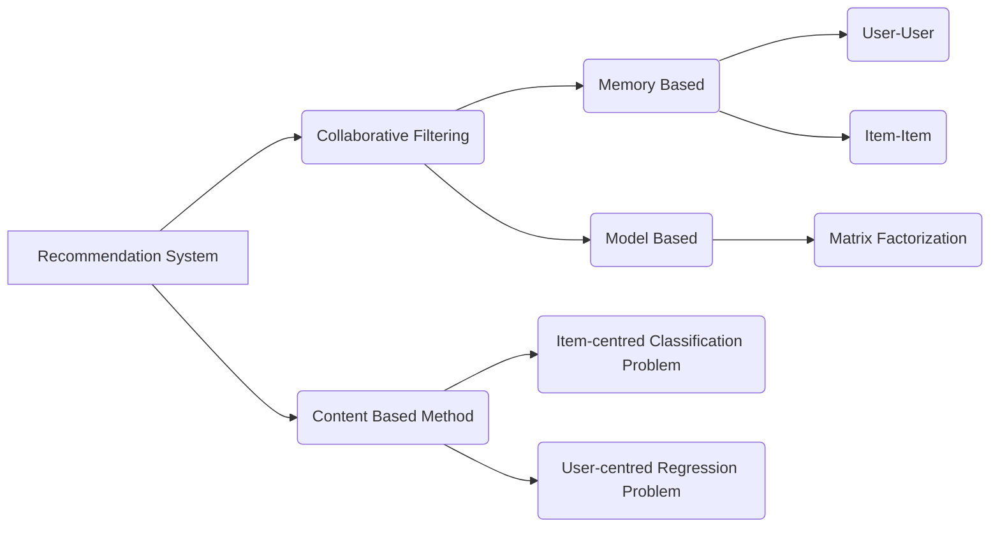

# Recommendation-System
## Goal: Suggest relevant items to users.

## Metholodolgy Graph

### Collaborative Filtering Method
   - Intuition: based solely on past interactions records between users and items to make new recommendations, stored in "`user-item interaction matrix`"
   -  Use past information to *detect similar users or items* and make predictions based on these estimated proximities.
   - Categories:
     - **Memory Based**: Directly work with recorded interactions.No models. Based on nearest neighbors.
       - User-User: Use KNN calculate the similarity between different users
       - Item-Item: Use KNN calculate the similarity between items will be recommended and users' prefered item.
     - **Model Based**: New representative users and items are build based on a generative model.
   - Advantages: Requires no information about users or items, just needs interactions.
   - Drawbacks: Suffer more cold start problem than Content-Based Method.
   
### Content Based Method
  - Intuition: Based on features explaining user-item interaction, regarded as classification(T/F,item-centred) or regression(rating,etc.,user-centred) problem.
  - Mix Up: Two features factors (information about both user-centered and item-centered) can be used in a **neutral network architecture**. 
    
## Paper
- [Collaborative Filtering Recommender Systems](https://files.grouplens.org/papers/FnT%20CF%20Recsys%20Survey.pdf)
- [Item-Based Collaborative Filtering Recommendation Algorithms](https://www.ra.ethz.ch/cdstore/www10/papers/pdf/p519.pdf)
